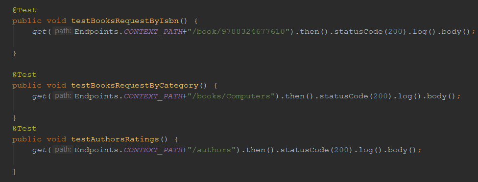
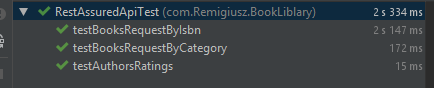

### Description:
BookLibrary is application which provides basic information about books.

I used **Spring Boot** to build REST Api,this framework is also responsible for error handling for my Api.

Tools such as **Postman** and **RestAssured** helped me perform tests on my api.

Most commonly used design pattern in this app is dependency incjection,i used it to inject BookService into api controller.

### Endpoints:
 - /authors - returns authors of books and thier ratings sorted descending.
 - /books/{category} - returns books assigned to specified category.
 - /book/{isbn} - returns single book asigned to specified isbn number.
 
### Data Source:

I fetched list of books from google api by folowing link:

https://www.googleapis.com/books/v1/volumes?q=java&maxResults=40&fields=items

### Tests results:

### Try it yourself !

You can test this app by running this project on you own computer and paste these links in your browser:

 - http://localhost:8080/Cognifide-BookLibrary/authors
 - http://localhost:8080/Cognifide-BookLibrary/books/Computers
 - http://localhost:8080/Cognifide-BookLibrary/book/9788324677610

